<h1 align="center">Tanmay Patil</h1>

  <b>Cybersecurity · SOC & Detection Engineering · Cloud Security</b>

  
  
  

  

  I build and test security systems with a focus on threat detection, log analysis,
  SIEM workflows, and cloud security monitoring.

---

<h3 align="center">About</h3>

  B.E. Information Technology graduate and <b>former Research Intern at ISRO's Space Applications Centre (SAC)</b>,
  with hands-on experience in threat detection, log analysis, and SIEM-related workflows.

  I enjoy understanding how systems work under the hood, finding where they break,
  and building practical ways to detect, analyze, and secure them.

<h3 align="center">Focus</h3>

  Threat Detection · SIEM · Blue Teaming · Incident Response · Security Monitoring · Cloud Security

---

<h3 align="center">Experience</h3>

  🛰️ <b>Research Intern — ISRO, Space Applications Centre (SAC)</b> 
  Threat Detection · Log Analysis · SIEM Workflows

---

<h3 align="center">Stack</h3>

  
  
  
  
  

  
  
  
  
  

---

<h3 align="center">Featured Work</h3>

  <a href="YOUR_THREAT_DETECTION_REPO_URL">🔐 Threat Detection & SIEM</a>
  &nbsp; · &nbsp;
  <a href="YOUR_AWS_SECURITY_REPO_URL">☁️ AWS Security</a>
  &nbsp; · &nbsp;
  <a href="YOUR_SECURITY_RESEARCH_REPO_URL">🧪 Security Research</a>

  Security labs, detection engineering experiments, cloud-security projects,
  and research-driven work focused on practical cybersecurity.

---

<h3 align="center">GitHub Stats</h3>

  
  

---

<h3 align="center">Certifications</h3>

  Google Cybersecurity · Google Cloud Cybersecurity · IBM Cybersecurity Fundamentals · Certified Ethical Hacking Specialist

---

<h3 align="center">Let's Connect</h3>

  Always happy to talk security, SOC tooling, detection engineering, cloud security,
  or opportunities in cybersecurity.

  
  

